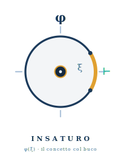

# insaturo

<p align="center">
  
</p>

> *Una specifica è un concetto col buco. L'implementazione non lo descrive —
> lo chiude. E «chiude» o è un teorema, o non è niente.*

Le **specifiche come concetti insaturi** alla Frege, in Agda — una firma con un
buco (`Sig`), gli obblighi che ogni chiusura deve rispettare (`Law`), e il
testimone che una certa impl chiude davvero il buco (`Conforms`). La grammatica
è **un oggetto di prima classe**: la passi, la componi, la mandi a un LLM. È il
precursore di [semeion](https://github.com/avit-io/semeion) — semeion applica
ai *segnali* la stessa distinzione di regime (emergenza vs fedeltà) che qui sta
nel nudo: una spec e le sue due chiusure.

---

## Il problema che ereditiamo

Una spec, di solito, è **sparsa**: una firma in un file, tre lemmi a lato, una
frase in un README («dev'essere monotòna»), un property test in un altro
linguaggio. Quattro pezzi dello stesso contratto, nessuno dei quali sa degli
altri. La domanda «*e nel caso X?*» non ha una risposta nel tipo: la cerchi
nella prosa, e la prosa è ambigua per costruzione.

Frege aveva il nome esatto per cosa manca. Un concetto è **ungesättigt**,
insaturo: `φ( )` ha un posto vuoto. Non è un oggetto finché un argomento non lo
**satura** — `φ(a)`. Una specifica *è* questo: il posto vuoto è ciò che l'impl
deve esibire; saturarlo è fornirlo, **insieme** alla prova che gli obblighi
reggono.

> insaturo non aggiunge teoremi a lato di una firma. Dà alla nozione «spec» un
> **corpo**: la firma, le leggi e il testimone di chiusura vivono nello stesso
> oggetto, e l'oggetto o typecheck o no.

---

## Come funziona

Tre pezzi, uno per costruttore concettuale (`Insaturo/Core.agda`):

```agda
record Sig ℓ : Set (suc ℓ) where
  field Carrier : Set ℓ        -- il DOMINIO del buco: cosa l'impl deve abitare

record Law (C : Set ℓ) : Set (suc ℓ) where
  field Holds : C → Set ℓ      -- un OBBLIGO osservabile sul candidato

record Spec ℓ : Set (suc ℓ) where
  field sig  : Sig ℓ
        laws : List (Law (Carrier sig))
```

`Carrier` è il buco: per una funzione `f : A → B` è `(A → B)`; per una struttura
algebrica è il record dei campi; per un witness è il tipo della prova. Tenerlo
astratto è il punto — la stessa grammatica vale per funzioni, relazioni,
strutture.

### Chiudere il buco è un teorema

`Conforms s impl` è il tipo «`impl` chiude la spec `s`»: un termine che, per
**ogni** legge, ne fornisce la prova su `impl`. È la saturazione fregeana resa
tipo — dato l'argomento mancante, il concetto insaturo diventa un oggetto saturo.

```agda
Conforms s impl = AllHold impl (laws s)          -- tutte le leggi valgono su impl

Sat s = Σ[ impl ∈ Carrier (sig s) ] Conforms s impl
```

`Sat` è l'oggetto che consegni: non «ecco l'impl» ma «ecco l'impl **e** la prova
che chiude la spec». Senza il secondo campo la consegna sarebbe disonesta — e
qui non è *rappresentabile* consegnarla senza prova.

### Il rifiuto è esprimibile quanto la chiusura

Speculare a `Sat`, il tipo «nessuna impl chiude la spec con questo candidato»:

```agda
Refuses s impl = ¬ (Conforms s impl)
```

Una spec onesta deve poter **dire** «questo candidato NON satura», non solo
tacere. È la risposta tipata alla domanda «e nel caso X?»: X è stato considerato
e respinto, e il respingimento è un teorema (`()`), non una riga di README.
*(È il `≢ forced arc` di semeion, un livello più in basso.)*

### Due chiusure, una grammatica — il ponte (regime 2)

Quando l'impl **non** vive in Agda — un LLM scrive Haskell, Rust, Gleam — la
prova non può essere un termine Agda sull'impl reale. Allora ogni legge
**decidibile** si proietta in un obbligo eseguibile: una batteria di check
booleani su campioni golden (`Insaturo/Bridge.agda`).

```agda
record DecLaw (C : Set ℓ) : Set (suc ℓ) where
  field law      : Law C
        Sample   : Set ℓ
        check    : C → Sample → Bool          -- il test, su un campione
        Witness  : C → Sample → Set ℓ
        reflects : ∀ c s → check c s ≡ true → Witness c s   -- il verde NON è vuoto

passesAll : (es : ExternalSpec ℓ) → ECarrier es → Bool
```

Questo è il **regime di fedeltà** (cf. semeion, regime 2): non una prova
emergente, ma un fatto falsificabile sul mondo. Il property test che fallisce è
il controesempio; il golden vector è il testimone esibito. L'onestà sta nel non
spacciare il secondo regime per il primo:

```
Conforms   (Core)   — PROVA:    la spec emerge.      regime 1
passesAll  (Bridge) — FEDELTÀ:  la spec è testata.   regime 2
```

`Obligation` è un tipo **diverso** da `Conforms`, e il tipo di ritorno è `Bool`,
non `Conforms`. Una pila di green test non è una prova — e il tipo lo dice.
Stessa `Spec` a monte; il tipo del testimone dice quale regime hai in mano.

### Il contratto sul filo — JSON sul serio (`Insaturo/Wire.agda`)

`ExternalSpec` è il ponte, ma è un oggetto Agda: dentro ci sono `Set` e
funzioni, niente che esca davvero. Per mandarlo a un LLM serve **JSON vero**.
L'unica cosa che mancava è come *scrivere* un campione:

```agda
record Encode (A : Set) : Set where field encode : A → String

record WireLaw (C : Set) : Set₁ where     -- un obbligo DECORATO per il filo
  field name    : String
        dlaw    : DecLaw C
        encS    : Encode (Sample dlaw)
        samples : List (Sample dlaw)

specJSON : (C : Set) → C → WireSpec C → String      -- il contratto, come String
```

`specJSON` rende ogni legge come una tabella di **golden vector** — coppie
`(campione, atteso)`, dove l'atteso è `check ref` calcolato da un'impl di
**riferimento**, non asserito (un campione che il riferimento stesso fallisce
esce `out:false`, e il contratto lo mostra):

```json
[{"law":"eqRef","golden":[{"in":"1","out":true},{"in":"2","out":false}]}]
```

Due cose restano oneste. Il **verdetto** non è nuovo: una `WireSpec`,
dimenticati nome ed encoder, *è* un `ExternalSpec` (`toExternal`), e si verifica
con la stessa `passesAll` — la serializzazione aggiunge come scrivere il
contratto, non un nuovo modo di accettarlo. E l'**onestà attraversa il filo**:

```agda
wireWitness : check (dlaw w) ref s ≡ true → check (dlaw w) cand s ≡ check (dlaw w) ref s
            → Witness (dlaw w) cand s        -- il golden verde riprodotto PORTA il testimone…
```

…ma solo sui campioni in tabella: è `greenWitness` lifato sul golden
serializzato — fedeltà, non emergenza. Chiude il giro Agda→Haskell: la stessa
`Spec` produce *e* il contratto che mandi (`specJSON`), *e* il verdetto su ciò
che torna (`passesAll`).

### Il round-trip è un teorema (`Insaturo/Codec.agda`)

Restava un salto di fede: fra la stringa `"2/5"` scritta sul filo e il campione
su cui `check` gira. Il runner esterno *parsa* la stringa — chi garantisce che
il parse recuperi proprio quel campione? Un `Codec` lo chiude:

```agda
record Codec (A : Set) : Set where
  field enc     : Encode A
        decode  : String → Maybe A
        inverse : (a : A) → decode (encode enc a) ≡ just a     -- decode ∘ encode ≡ just
```

Modellato il runner come «decodifica, poi `check`», la legge di round-trip dà
il teorema:

```agda
runnerVerdict d cdc cand str = map (check d cand) (decode cdc str)

runnerSound : runnerVerdict d cdc cand (encode (enc cdc) s) ≡ just (check d cand s)
runnerSound d cdc cand s rewrite inverse cdc s = refl
```

Il runner che riparsa l'input serializzato calcola **esattamente** `check cand
s` — sul campione *inteso*, non su uno ricostruito a caso. L'encoder esce dalla
lista «cosa NON è garantito»: resta solo l'obbligo di **fornire** un `Codec` la
cui `inverse` regga (per ℕ/ℚ è un parser verificato — vedi roadmap). Un `Codec`
è anche un `Encode` (`codecEncode`): guida `specJSON` come prima.

### L'esempio: il README diventa il file `.agda`

`Insaturo/Example.agda` specifica un bound `n ≤ d` in [0,1] — lo stesso dominio
*ratio* di semeion — e mostra le tre frasi che chiudono ogni ambiguità:

```agda
saturated        : Sat ratioSpec                  -- "esiste un'impl che chiude"      ✓ refl
theBoundConforms : Conforms ratioSpec theBound    -- "QUESTA impl la chiude"          ✓ refl
badRefused       : ¬ (5 ≤ 2)                       -- "QUEST'ALTRA è impossibile"      ✓ ()
```

Tre frasi, tre teoremi. Il README diventa il `.agda`: o typechecka o no. È il
*markdown sotto steroidi* — non ambiguo per costruzione.

### Le spec si compongono — la grammatica è di prima classe

Una grammatica è di prima classe solo se i suoi oggetti **si compongono**. Due
modi, uno per costruttore concettuale (`Insaturo/Compose.agda`):

```agda
_×ˢ_ : Spec ℓ → Spec ℓ → Spec ℓ     -- PRODOTTO dei buchi: C, D ⇒ il buco-coppia C × D
_∧+_ : (s : Spec ℓ) → List (Law (Carrier (sig s))) → Spec ℓ   -- RAFFORZAMENTO: stesso buco, più leggi
```

`_×ˢ_` specifica due componenti insieme tenendo separati i loro obblighi (ogni
lato tirato indietro lungo la sua proiezione); `_∧+_` stringe una spec
aggiungendo leggi sullo **stesso** buco. Ma i costruttori non sono il punto — lo
sono i **teoremi**: conformità al composto ⇔ conformità ai pezzi.

```agda
×ˢ-split : Conforms (s ×ˢ t) (i , j) → Conforms s i × Conforms t j   -- e ×ˢ-join, il ritorno
∧+-split : Conforms (s ∧+ extra) impl → Conforms s impl × AllHold impl extra
```

Da lì cadono i corollari onesti, ed è qui che la composizione **paga**:

```agda
sat×ˢ     : Sat s → Sat t → Sat (s ×ˢ t)              -- la saturazione del tutto EMERGE dai pezzi
refuse×ˢˡ : Refuses s i → Refuses (s ×ˢ t) (i , j)    -- il rifiuto di un pezzo RIFIUTA il tutto
∧+-weaken : Conforms (s ∧+ extra) impl → Conforms s impl   -- rafforzare RESTRINGE, mai allarga
```

Saturi i componenti separatamente e il prodotto è saturato per teorema
(`sat×ˢ`); l'onestà si propaga al composto (`refuse×ˢˡ/ʳ`); più leggi danno una
spec più stretta, mai più larga (`∧+-weaken`).

---

## La metafora

**insaturo** — *ungesättigt*, l'insaturo di Frege. Un concetto `φ( )` ha un
posto vuoto: non designa un oggetto finché un argomento non lo riempie. È la
distinzione fra *funzione* (insatura, con la lacuna `ξ`) e *oggetto* (saturo,
completo) — il cuore della *Begriffsschrift*.

| insaturo            | specifica / implementazione                       |
|---------------------|---------------------------------------------------|
| il concetto `φ( )`  | `Spec` — la firma col buco e i suoi obblighi       |
| il posto vuoto `ξ`  | `Carrier` — il dominio del buco, l'argomento atteso|
| saturare `φ(a)`     | `Conforms` — chiudere il buco, con la prova        |
| l'oggetto saturo    | `Sat` — impl **e** testimone, consegnati insieme   |
| il posto non chiuso | `Refuses` — nessuna saturazione: e lo si dimostra  |
| la chiusura provata | regime 1 (`Conforms`): emerge in Agda              |
| la chiusura testata | regime 2 (`passesAll`): fedeltà su un'impl esterna |

> *Una spec senza il suo testimone di chiusura è un concetto che finge di essere
> un oggetto.*

---

## Come libreria

```nix
# flake.nix del tuo progetto
inputs.insaturo.url = "github:avit-io/insaturo";
inputs.insaturo.inputs.nixpkgs.follows = "nixpkgs";
```

```
# mio-progetto.agda-lib
name: mio-progetto
include: .
depend: standard-library insaturo
```

### Come sviluppatore di insaturo

```bash
git clone https://github.com/avit-io/insaturo
cd insaturo
agda Insaturo/Core.agda      # --safe --without-K, zero postulate
```

---

## Struttura del progetto

```
insaturo/
├── Insaturo/
│   ├── Core.agda       # Sig · Law · Spec · Conforms · Sat · Refuses (la grammatica)
│   ├── Bridge.agda     # DecLaw · ExternalSpec · passesAll (regime 2: l'impl fuori da Agda)
│   ├── Wire.agda       # Encode · WireLaw · specJSON (il contratto come JSON) · wireWitness
│   ├── Codec.agda      # Codec (encode/decode/inverse) · runnerSound: il round-trip è un teorema
│   ├── Compose.agda    # _×ˢ_ (prodotto dei buchi) · _∧+_ (rafforzamento) + i teoremi
│   └── Example.agda    # il DSL all'opera: saturazione e rifiuto come teoremi
├── insaturo.agda-lib   # depend: standard-library (radice: zero dep d'ecosistema)
└── flake.nix           # packages.lib · lib.mkShell · devShells.default
```

---

## Relazione con l'ecosistema

insaturo è la **macchina nuda**: spec, conformità, rifiuto, e i due regimi di
chiusura. Non parla di nessun dominio. [semeion](https://github.com/avit-io/semeion)
è la stessa distinzione **incarnata** sui segnali SRE: lì `Conforms`/`Refuses`
diventano `forced`/`¬ forced` su un `Display`, e il regime 2 diventa la fedeltà
a un fatto di Grafana. insaturo viene prima nel significato; semeion gli dà un
mondo.

```
        insaturo  ← la grammatica delle spec (Sig · Law · Conforms)
           │         regime 1 = prova · regime 2 = fedeltà
           ▼
        semeion   ← la stessa distinzione, incarnata sui segnali
```

Ordine di dipendenza: entrambe sono **radici** (`depend: standard-library`).
insaturo non importa semeion né viceversa — la parentela è concettuale, non un
`import`.

---

## Garanzie strutturali

- **chiusura non asseribile** — `Sat s` esige `Conforms s impl`: non puoi
  consegnare un'impl senza la prova che chiude la spec. La disonestà non è
  rappresentabile.
- **rifiuto di prima classe** — `Refuses s impl` è un tipo abitabile: «X non
  satura» è un teorema (`()`), non un silenzio. La domanda «e nel caso X?» ha
  una risposta nel tipo.
- **due regimi, due tipi** — `Conforms` (prova) e `passesAll` (`Bool`, fedeltà)
  sono tipi diversi a monte della stessa `Spec`. Un verde di test non si
  traveste da prova: `reflects` garantisce che il verde **porta** un testimone,
  ma solo sui campioni testati — fedeltà, non emergenza.
- **grammatica polimorfa** — `Carrier` è un `Set` qualunque: la stessa `Spec`
  vale per funzioni, relazioni, strutture. Nessun mapping cablato a un dominio.
- **composizione provata** — `Conforms (s ×ˢ t) (i , j) ⇔ Conforms s i × Conforms
  t j` e `Conforms (s ∧+ extra) ⇔ Conforms s × AllHold extra`: comporre spec non
  perde né aggiunge obblighi di nascosto. La saturazione del prodotto emerge dai
  pezzi (`sat×ˢ`), il rifiuto si propaga (`refuse×ˢˡ/ʳ`), rafforzare restringe
  (`∧+-weaken`).
- **serializzazione senza nuovo verdetto** — `specJSON` rende il contratto in
  JSON, ma una `WireSpec` *è* un `ExternalSpec` (`toExternal`) e si verifica con
  la stessa `passesAll`: il filo non introduce un modo di accettare diverso dal
  regime 2. L'onestà attraversa il filo (`wireWitness`): un golden verde
  riprodotto porta il `Witness`, solo sui campioni in tabella.

`--safe --without-K`, zero `postulate`, zero `TERMINATING`, zero `trustMe`.

### Cosa NON è garantito (onestà sopra tutto)

- **il legame law↔decide è scelto dall'autore** — `DecLaw` tiene `Witness` e
  `reflects` come campi: insaturo non impone *una* nozione di «il test riflette
  la legge», la lascia a chi scrive la legge. È flessibilità voluta, ma è fede
  riposta nell'autore della `DecLaw`.
- **`AllHold` è puntuale, non quantificato** — `Conforms` prova le leggi su *un*
  candidato dato, non «per ogni impl». È così che dev'essere (saturazione di un
  argomento), ma non è una prova di universalità.
- **il candidato è reificato** — il verdetto (`passesWire`) gira su un candidato
  `C` reificato in Agda: che `C` rispecchi il comportamento reale dell'impl
  Haskell resta la fede di sempre del regime 2. Wire serializza il contratto, non
  l'impl.
- **il Codec va fornito, e la sua legge regge solo se la dimostri** — con
  `runnerSound` il round-trip dell'input *è* un teorema (`Insaturo/Codec.agda`):
  l'encoder non è più fede. Ma il teorema è parametrico su un `Codec` la cui
  `inverse` (`decode ∘ encode ≡ just`) hai dimostrato. Per campioni ricchi (ℕ,
  ℚ) ciò richiede un parser verificato — fede spostata, non ancora azzerata
  (roadmap). Il `Codec` identità su `String` la regge con `refl`.

---

## Roadmap

In ordine di valore:

1. **Un `Codec` verificato per ℕ/ℚ** — `runnerSound` rende il round-trip un
   teorema *dato* un `Codec` lawful; resta da costruirne uno per i campioni
   ricchi (parse decimale di ℕ, razionali di ℚ) con la `inverse` dimostrata,
   così la fede dell'encoder si azzera sul serio e non solo sul `Codec` identità.

### Già implementato

- **Il round-trip come teorema** (`Insaturo/Codec.agda`) — `Codec` (encode +
  `decode : String → Maybe A` + la legge `decode ∘ encode ≡ just`) e `runnerSound`:
  il runner che riparsa l'input serializzato calcola `check` sul campione
  *inteso*, non su uno ricostruito. L'encoder esce dai «non garantiti», a meno
  della `inverse` del Codec fornito. Un `Codec` è anche un `Encode`
  (`codecEncode`): guida `specJSON` come prima.
- **Il ponte serializzabile** (`Insaturo/Wire.agda`) — `Encode` + `WireLaw` +
  `specJSON`: il contratto esce come JSON vero (leggi nominate + golden vector,
  l'atteso calcolato da un riferimento, non asserito). Il verdetto non è nuovo:
  una `WireSpec` *è* un `ExternalSpec` (`toExternal`), verificata da `passesAll`.
  L'onestà attraversa il filo (`wireWitness`): un golden verde riprodotto porta
  il `Witness`, solo sui campioni in tabella. Chiude il giro Agda→Haskell —
  stessa `Spec`, il contratto che mandi e il verdetto su ciò che torna.
- **Composizione di spec** (`Insaturo/Compose.agda`) — `_×ˢ_` (prodotto dei
  buchi: `C, D ⇒ C × D`, ogni lato tirato indietro lungo la proiezione) e `_∧+_`
  (rafforzamento: stesso buco, leggi congiunte). Con i teoremi di
  conformità⇔pezzi (`×ˢ-split/join`, `∧+-split/join`) e i corollari onesti:
  `sat×ˢ` (la saturazione del prodotto emerge dai pezzi), `refuse×ˢˡ/ʳ` (il
  rifiuto si propaga), `∧+-weaken` (rafforzare restringe). La grammatica è ora di
  prima classe — le spec si compongono.

---

## Licenza

MIT — il concetto è libero, la chiusura è forzata.

---

> *«Prima di dire che un'impl è corretta, chiediti quale buco chiude — e se la
> chiusura è una prova, o la stai solo asserendo.»*
